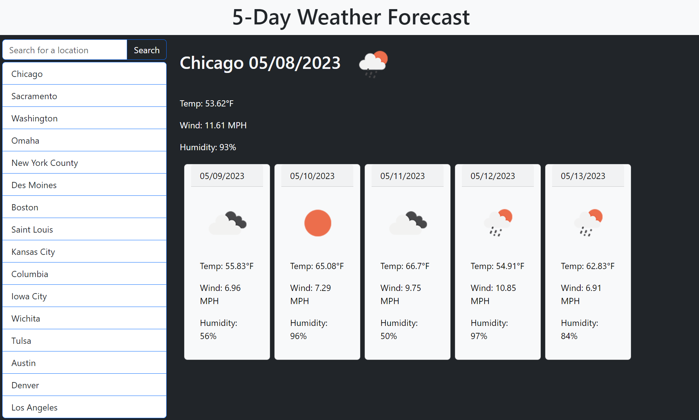

# Weather_App
5-day weather app using OpenWeather API

## Description

Weather application that allows users to search for a location and display it's current weather along with the next 5 days' forecast.

## Usage

A search box in the upper left of the page allows users to input a city by name. Clicking the Search button returns weather data for this location. The current day's weather is displayed largest, followed by 5 boxes (one for each day) containing a forecast for the preceding days.  

Once search, a location will be stored via a listing of clickable elements on the left side of the page. Clicking one of these locations will display its respective weather data again.  

OpenWeather's API is utilized to retrieve the weather data. All units are Imperial.

A Bootstrap framework was used for all visualizations of this page.

The site can be viewed at: https://creechj.github.io/Weather_App

GitHub repository for the site can be found here: https://github.com/creechj/Weather_App

## Resources

API source and documenation for URL calls:  
https://openweathermap.org/forecast5

Reference for inserting icons in spans as "img src. . .":  
https://stackoverflow.com/questions/6915779/javascript-putting-an-image-in-a-span

Substring syntax used to reformat the dates from API:  
https://www.w3schools.com/jsref/jsref_substr.asp

fetch().then() method for API call/return:  
https://stackoverflow.com/questions/73855468/how-to-use-fetch-then-to-get-response-body

Boostrap sizing and positioning:
https://getbootstrap.com/docs/5.3/utilities/flex/

## License

Please refer to LICENSE included in repository